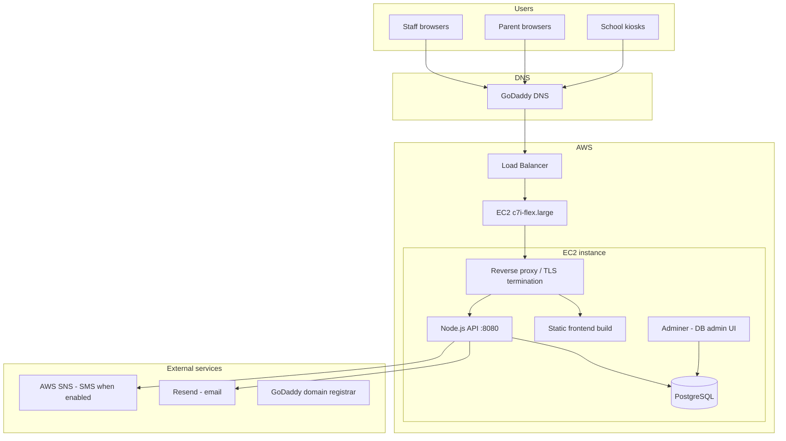

# PulseEDU — AWS Hosting and Infrastructure Overview

**Document type:** Production hosting reference for administrators and launch documentation  
**Production URL:** https://pulseedu.pulsekinetics.us/  
**Last updated:** June 2026

---

## 1. Executive summary

PulseEDU production runs on **Amazon Web Services (AWS)** using a single **EC2** application server that hosts the web client, API server, and PostgreSQL database. Public access is provided through the custom domain **`pulseedu.pulsekinetics.us`**, registered with **GoDaddy**, with DNS pointing to the AWS environment. An **AWS load balancer** is attached to support increased traffic without changing the application architecture.

This document describes the current production topology, instance sizing, request flow, and operational responsibilities. It is intended for client handoff, internal operations, and launch checklist evidence (“AWS hosting confirmation”).

---

## 2. Production endpoints

| Item | Value |
|------|--------|
| **Public site** | https://pulseedu.pulsekinetics.us/ |
| **API** | Same origin: `/api/*` (proxied to the Node.js API on the server) |
| **Parent portal** | https://pulseedu.pulsekinetics.us/parent/* |
| **Signage / kiosk** | Path-based routes on the same host (`/signage/*`, kiosk flows) |

The application is designed for **same-origin** browser requests: the React client and API share one hostname so session cookies and CSRF protections work reliably in production.

---

## 3. High-level architecture

**Traffic path (typical):**

1. User opens `https://pulseedu.pulsekinetics.us`
2. DNS (GoDaddy) resolves to the AWS load balancer or instance endpoint
3. TLS terminates at the load balancer and/or on the instance reverse proxy
4. Static assets are served for the React client
5. `/api` requests are forwarded to the Express API (`PORT=8080`)
6. The API reads/writes **PostgreSQL** via `DATABASE_URL`

---

## 4. Domain and DNS

| Component | Provider / role |
|-----------|-----------------|
| **Domain** | `pulseedu.pulsekinetics.us` (under `pulsekinetics.us`) |
| **Registrar** | GoDaddy |
| **Purpose** | Production hostname for staff app, parent portal, and API |

**Operational notes:**

- DNS records (A/AAAA or CNAME) at GoDaddy must point to the current AWS load balancer or EC2 public endpoint.
- After infrastructure changes (new LB, new IP, failover), update GoDaddy DNS and verify HTTPS certificate coverage for `pulseedu.pulsekinetics.us`.
- Keep registrar and AWS access under **client-owned accounts** where possible.

---

## 5. AWS compute — EC2

### 5.1 Instance specification (production)

| Attribute | Value |
|-----------|--------|
| **Service** | Amazon EC2 |
| **Instance type** | `c7i-flex.large` |
| **vCPU** | 2 |
| **Memory** | 4 GiB |
| **Storage** | 50 GB (EBS volume) |

The **c7i-flex** family provides burstable CPU suitable for variable school-day traffic (morning peaks, quieter evenings).

### 5.2 Workloads on the instance

The EC2 host runs:

| Workload | Description |
|----------|-------------|
| **Frontend** | Built PulseEDU client (static files) |
| **Backend** | PulseEDU API server (Node.js 24, Express 5) |
| **Database** | PostgreSQL (production database for PulseEDU) |
| **Adminer** | Web-based database administration tool (operator access only; not part of the student-facing app) |
| **Reverse proxy** | Terminates HTTPS from the load balancer (or direct), routes `/` and `/api` |

> **Note:** Adminer is a **management UI** for PostgreSQL. The production database engine is **PostgreSQL**, not Adminer. Restrict Adminer to trusted networks/VPN or IP allowlists; do not expose it publicly without strong access controls.

### 5.3 Load balancer

An **AWS load balancer** is attached in front of the application tier to:

- Distribute traffic when concurrent usage grows
- Provide a stable DNS target for GoDaddy records
- Support health checks and future horizontal scaling (additional EC2 instances behind the same LB)

Today’s deployment may run **one** EC2 instance behind the balancer; the LB remains the extension point for scale-out.

---

## 6. Application configuration (production)

Environment variables for the API are stored on the server (e.g. `artifacts/api-server/.env`). Minimum production settings:

| Variable | Purpose |
|----------|---------|
| `NODE_ENV` | `production` |
| `PORT` | API listen port (e.g. `8080`) |
| `PUBLIC_APP_URL` | `https://pulseedu.pulsekinetics.us` |
| `CORS_ORIGINS` | `https://pulseedu.pulsekinetics.us` |
| `DATABASE_URL` | PostgreSQL connection string (typically `localhost` or `127.0.0.1` on same EC2) |
| `SESSION_SECRET` | Session signing secret (rotate on compromise) |

Optional integrations (see `.env.production.example`):

- `RESEND_API_KEY` / `RESEND_FROM_EMAIL` — transactional email  
- AWS credentials / SNS settings — SMS notifications when enabled  
- Object storage paths — media uploads (if configured for this deployment)

The API sets `trust proxy` so secure cookies work correctly behind the load balancer and reverse proxy.

---

## 7. Data layer on AWS

| Item | Detail |
|------|--------|
| **Engine** | PostgreSQL |
| **Location** | Co-located on the production EC2 instance (same server as API) |
| **Access** | Application via `DATABASE_URL`; operators via Adminer (restricted) |
| **Schema** | Managed in application source; full data model in the **Database Architecture Overview** |

**Backup recommendation (operational):**

- Automated EBS snapshots and/or `pg_dump` on a schedule  
- Off-instance copy (S3 or separate region) for disaster recovery  
- Document RPO/RTO and run at least one restore drill before launch sign-off  

> For higher availability long term, consider **Amazon RDS for PostgreSQL** instead of on-instance Postgres; that would be a planned migration, not the current baseline.

---

## 8. Security and network (baseline)

| Control | Implementation |
|---------|----------------|
| **HTTPS** | Required for production; TLS at load balancer and/or reverse proxy |
| **Session cookies** | `HttpOnly`, `Secure` in production, `SameSite=Lax` |
| **CORS** | Allowlist limited to production origin |
| **Firewall** | AWS security groups: allow 443 (and 80 redirect) from internet to LB/instance; restrict SSH and Adminer to admin IPs |
| **Secrets** | `.env` on server only; never committed to git |

Detailed application security controls are documented in the **Security and Privacy Evidence Pack** and **Security Verification Checklist**.

---

## 9. External services (outside EC2)

PulseEDU on AWS still depends on these non-EC2 services when enabled:

| Service | Use |
|---------|-----|
| **GoDaddy** | Domain registration and DNS |
| **Resend** | Email (invites, pullout dispatch, HeartBEAT, etc.) |
| **AWS SNS** | SMS to staff (pullout alerts and future workflows) — requires paid/verified AWS billing |
| **ClassLink / OneRoster** (planned) | Roster and SSO — API calls from EC2 to vendor endpoints |

Each should be listed in the client **subprocessor** inventory.

---

## 10. Deployment model

| Aspect | Approach |
|--------|----------|
| **Code** | Monorepo (`PulseEDU4`): `pnpm run build` produces API bundle and client static assets |
| **Deploy target** | EC2 instance (pull/build on server or CI artifact upload) |
| **Process manager** | Typically systemd or PM2 (confirm on server) |
| **Database migrations** | Drizzle push / controlled SQL in maintenance windows |
| **Zero-downtime** | Single-instance deploys may brief-restart API; LB health checks help route around unhealthy targets when multiple instances exist |

Exact deploy commands and paths on disk should be recorded in an internal runbook (server path, restart command, log locations).

---

## 11. Monitoring and operations (recommended)

| Area | Recommendation |
|------|----------------|
| **Uptime** | LB health check + external ping on `/` or health endpoint |
| **Logs** | API stdout/log files; reverse proxy access logs |
| **Disk** | Alert on EBS volume >80% (50 GB includes DB growth) |
| **CPU/RAM** | CloudWatch metrics for EC2; 4 GiB RAM must cover Postgres + Node under peak |
| **Incidents** | Follow the **Incident Response and Credential Rotation Runbook** |

---

## 12. Ownership and access (client handoff)

| Asset | Intended owner |
|-------|----------------|
| GoDaddy domain / DNS | Client |
| AWS account (EC2, LB, SNS, billing) | Client |
| EC2 SSH / SSM access | Client + designated operators |
| PostgreSQL credentials | Client; shared with app via `DATABASE_URL` |
| Resend / third-party API keys | Client or vendor-managed per contract |

The development team configures and maintains the application; **infrastructure billing and account ownership** remain with the client for long-term sustainability.

---

## 13. Capacity and scaling notes

| Current sizing | Implication |
|----------------|-------------|
| 2 vCPU / 4 GiB / 50 GB | Suitable for initial school launch and moderate concurrent staff |
| Single EC2 + Postgres on box | Simple ops; DB and app compete for RAM — monitor under load |
| Load balancer present | Add second EC2 instance behind LB when CPU or redundancy requires it |
| c7i-flex burstable | Good for daily peaks; sustained 100% CPU may need larger instance or split DB to RDS |

---

## 14. Launch checklist alignment

| Launch tracker item | Evidence in this document |
|---------------------|---------------------------|
| AWS hosting confirmation | Domain, EC2 spec, architecture diagram, ownership table |
| Backup and recovery plan | Section 7; backup drill evidence in the **Backup and Disaster Recovery Guide** |
| AWS messaging (SNS) | Section 9; SNS configured in client AWS account |

---

## 15. Document control

| Field | Value |
|-------|--------|
| **Version** | 1.0 |
| **Environment described** | Production — `pulseedu.pulsekinetics.us` |
| **Review trigger** | EC2 resize, LB change, RDS migration, or DNS provider change |

**Items to confirm with operations and fill in internal runbook:**

- AWS region and account ID  
- Load balancer type (ALB/NLB) and target group name  
- Exact reverse proxy (nginx/Caddy) config path  
- PostgreSQL version and backup schedule  
- Whether Adminer is IP-restricted or VPN-only  
