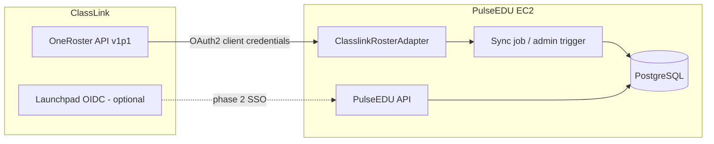

# PulseEDU — ClassLink / OneRoster Integration Overview

**Document type:** Integration specification and implementation guide  
**Audience:** District IT, ClassLink administrators, and PulseEDU developers  
**Status:** **Planned — not yet live in production** (adapter scaffold exists; sync implementation in progress)

---

## 1. Purpose

This document describes how PulseEDU will connect to **ClassLink** using the **OneRoster 1.1** API to import and refresh roster data automatically. It is the reference for **building, configuring, and operating** the integration.

Until this integration is live, schools should continue using:

- **Settings → Data Importer** (CSV), and  
- **Settings → Onboarding Checklist**

---

## 2. Integration goals

| Goal | Detail |
|------|--------|
| **Reduce manual CSV work** | Nightly refresh of core roster entities |
| **Improve accuracy** | Single source of truth from district SIS via ClassLink |
| **Stay school-scoped** | Every record lands with correct `school_id` |
| **Fail safely** | Sync errors visible to admins; no silent cross-school leakage |
| **One-way sync** | ClassLink → PulseEDU only (no write-back to SIS in v1) |

**Initial rollout target:** Hernando County (expandable to other ClassLink districts using the same adapter).

---

## 3. Two ClassLink capabilities (separate)

ClassLink is used in **two independent ways** in PulseEDU architecture:

| Capability | Purpose | Adapter in code | v1 priority |
|------------|---------|-----------------|-------------|
| **OneRoster rostering** | Students, staff, sections, enrollments | `ClasslinkRosterAdapter` | **Primary** |
| **ClassLink SSO (OIDC)** | Staff sign-in via Launchpad | `ClasslinkSsoAdapter` | **Optional / phase 2** |

A district may use rostering without SSO, or SSO without rostering (e.g. Skyward roster + ClassLink login). Configuration is per school in `district_integrations`.

---

## 4. Current implementation status

| Component | Status |
|-----------|--------|
| `lib/sis-adapters` package | **Scaffolded** |
| `ClasslinkRosterAdapter.ping()` | Checks env credentials only |
| `listStudents` / `listStaff` / `listRoomAssignments` | **Not implemented** (`AdapterNotImplementedError`) |
| `ClasslinkSsoAdapter` | **Not implemented** |
| `district_integrations` table | **Ready** for per-school provider config |
| Scheduled sync job | **Planned** |
| Admin “Sync now” / status UI | **Planned** |
| Nightly cron | **Planned** |

This document defines the **target end state** for implementation.

---

## 5. Architecture

**Credential rule:** Secrets live in **environment variables** on the server. `district_integrations.sis_config` stores **references** (env var names, URLs), not plaintext client secrets.

### 5.1 Example configuration shape

Stored in `district_integrations` when `sis_provider = 'classlink'`:

| Field | Example |
|-------|---------|
| `rostersBaseUrl` | `https://<district>.classlink.com/oneroster/v1p1` |
| `rostersClientIdEnvVar` | `CLASSLINK_ONEROSTER_CLIENT_ID` |
| `rostersClientSecretEnvVar` | `CLASSLINK_ONEROSTER_CLIENT_SECRET` |

Optional SSO (`sso_provider = 'classlink'`):

| Field | Example |
|-------|---------|
| `oidcIssuer` | ClassLink issuer URL |
| `oidcClientIdEnvVar` / `oidcClientSecretEnvVar` | Env var names |
| `oidcRedirectUri` | `https://pulseedu.pulsekinetics.us/api/auth/classlink/callback` (exact path TBD at implement) |

---

## 6. OneRoster entities and PulseEDU mapping (v1)

The adapter maps vendor-neutral `Sis*` types (`lib/sis-adapters/src/types.ts`) into PulseEDU tables.

### 6.1 Students

| OneRoster concept | PulseEDU target |
|-------------------|-----------------|
| `User` (role student) | `students` |
| `sourcedId` | `students.student_id` (district stable ID) |
| `givenName` / `familyName` | `first_name`, `last_name` |
| `grades` | `grade` |
| Demographics / metadata | `ell`, `ese`, `is_504`, `gender`, `race`, `ethnicity` where available |
| Org / school linkage | `students.school_id` via school mapping table |

**Rules:**

- Upsert on `(school_id, student_id)`  
- Deactivate or flag students no longer in feed (policy TBD: soft inactive vs archive)  

### 6.2 Staff

| OneRoster concept | PulseEDU target |
|-------------------|-----------------|
| `User` (role teacher/admin) | `staff` (with allowlist policy) |
| `sourcedId` | `staff.external_id` |
| `email` | `staff.email` (must be unique globally today) |
| `org` | `staff.school_id` |

**Rules:**

- New staff from sync may require **allowlist** activation before login (district policy)  
- Do not overwrite password hashes from OneRoster in v1  

### 6.3 Sections and enrollments (schedules)

| OneRoster concept | PulseEDU target |
|-------------------|-----------------|
| `Class` | `class_sections` |
| `Enrollment` | `section_roster` (and related period models) |
| Teacher assignment | Period roster / teacher–student linkage used by **Teacher Roster** and **Student Finder** |

### 6.4 Room assignments (optional v1)

| Adapter method | PulseEDU target |
|----------------|-----------------|
| `listRoomAssignments()` | `staff_defaults.default_location_name` or homeroom field |

---

## 7. School mapping (critical)

ClassLink **orgs** must map to PulseEDU **`schools.id`**:

| ClassLink | PulseEDU |
|-----------|----------|
| `org.sourcedId` or state school code | `schools.state_school_code` or mapping table |
| Org display name | Validation only |

**District IT must confirm** mapping before first production sync. Wrong mapping is the highest-risk configuration error (data at wrong school).

---

## 8. Sync behavior (planned)

### 8.1 Frequency

| Mode | Schedule |
|------|----------|
| **Production default** | **Nightly** (off-peak, per school timezone) |
| **Manual** | Admin **“Sync now”** button (role-gated) |

### 8.2 Sync pipeline (logical steps)

1. Load `district_integrations` for school → `classlink` config  
2. Obtain OAuth2 access token from OneRoster  
3. Fetch changed users/classes/enrollments (full fetch v1; delta later)  
4. Transform to `SisStudent`, `SisStaff`, etc.  
5. Upsert within **single school transaction** where possible  
6. Update `sis_last_sync_at`, `sis_last_sync_status`, error summary  
7. Log row-level errors without stopping entire district if one school fails  

### 8.3 Failure handling (agreed posture)

| Behavior | Detail |
|----------|--------|
| **Visibility** | Errors reported to **administrators** (sync status screen / email digest TBD) |
| **Classroom staff** | No automatic failure spam to teachers |
| **Partial failure** | School-level status: success / partial / failed |
| **Fallback** | CSV importer remains available |

### 8.4 Idempotency

Repeated nightly runs should converge to the same roster state. No duplicate students on re-sync if keys are stable.

---

## 9. Data **not** in scope for ClassLink v1

These remain on **CSV importers** or manual entry:

| Data | Tool |
|------|------|
| FAST / MAP / iReady scores | Data Importer — assessments |
| Historical PBIS / behavior | Data Importer or in-app |
| Parent portal invites | Admin Parent Access workflow |
| Investigation / case notes | In-app only |

---

## 10. ClassLink App Library and district approval

Before production sync:

1. Register PulseEDU in **ClassLink App Library** (district enables app).  
2. District issues **OneRoster API credentials** (client id/secret, base URL).  
3. District IT provides **org ↔ school** mapping.  
4. PulseEDU configures `district_integrations` + server env vars.  
5. Run **test sync** against staging or limited pilot school.  
6. District sign-off → enable nightly job in production.

---

## 11. Implementation phases (engineering)

Aligned with the **ClassLink Integration — Scope & Schedule** document (provided separately in the launch package):

| Phase | Deliverable | Target |
|-------|-------------|--------|
| **1** | OAuth + OneRoster read (users, classes, enrollments) | Week 1 |
| **2** | Upsert students + staff + school mapping | Week 1 |
| **3** | Sections / enrollments → teacher roster | Week 1 |
| **4** | Nightly job + `sis_last_sync_*` fields | Week 1 |
| **5** | Admin sync status UI | Week 1–1.5 |
| **6** | ClassLink approval + Hernando production validation | Weeks 2–3 |
| **7** | Production go-live | ~3 weeks from kickoff |
| **Later** | ClassLink SSO (`ClasslinkSsoAdapter`) | Separate phase |
| **Later** | OneRoster delta / incremental sync | Optimization |

---

## 12. Security and compliance

| Topic | Practice |
|-------|----------|
| **Credentials** | Env vars only; rotate on staff change |
| **Transport** | HTTPS to ClassLink APIs |
| **FERPA** | ClassLink acts as school official pipeline; same tenancy rules after import |
| **Logging** | Log sync job metadata; avoid logging full student rows at info level |
| **Least privilege** | OneRoster read-only scopes for sync account |

---

## 13. Testing checklist (before go-live)

| # | Test |
|---|------|
| 1 | `ping()` succeeds with district credentials |
| 2 | Test school mapping — record counts match expected |
| 3 | Known student appears with correct ID and grade |
| 4 | Known teacher appears with correct email |
| 5 | Teacher Roster shows expected class for teacher |
| 6 | Re-run sync — no duplicates |
| 7 | Wrong credentials — graceful error, no data corruption |
| 8 | Second school in district — no cross-school writes |

---

## 14. Operations after go-live

| Task | Owner |
|------|--------|
| Monitor nightly sync status | District admin / IT |
| Re-run manual sync after SIS cleanup | School admin |
| Credential rotation | District IT + platform operator |
| Onboard additional districts | SuperUser + mapping review |

---

## 15. Document control

| Field | Value |
|-------|--------|
| **Version** | 1.0 (pre-implementation specification) |
| **Implementation** | ClassLink roster adapter and per-school district integrations configuration |
| **Update when** | First successful production sync completes |
