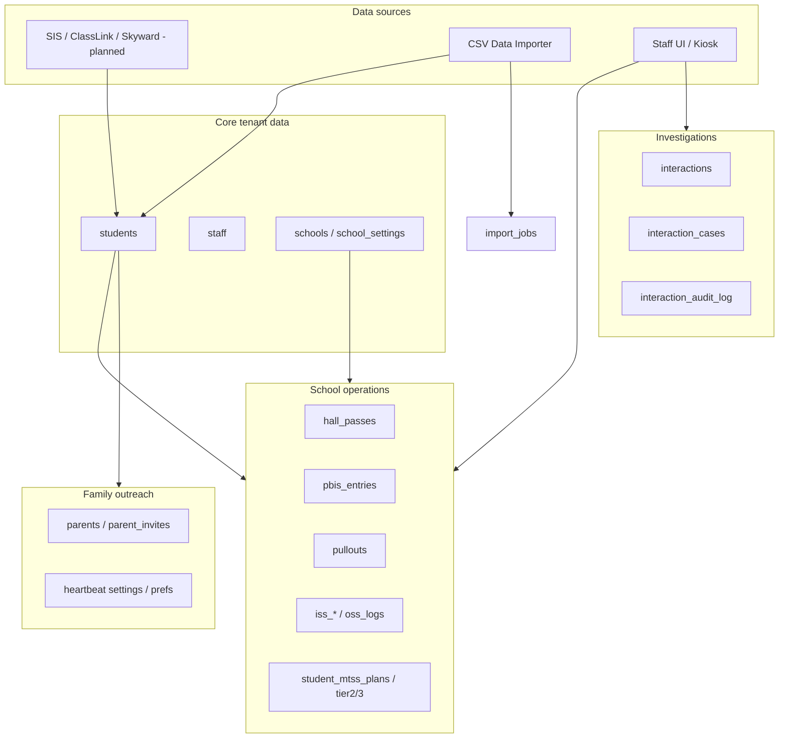
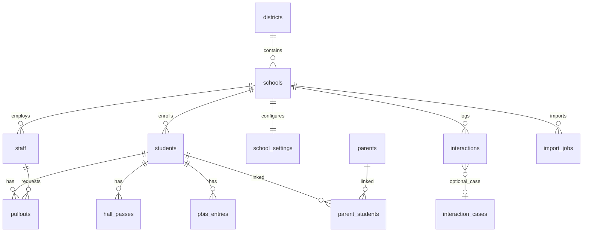

# PulseEDU — Database Architecture Overview

**Document type:** Technical reference for administrators, developers, and launch documentation  
**Database:** PostgreSQL  
**ORM / schema source of truth:** Drizzle ORM (`lib/db/src/schema/`)  
**Connection:** `DATABASE_URL` (Node.js `pg` pool + Drizzle client in `lib/db/src/index.ts`)

---

## 1. Executive summary

PulseEDU stores all application data in a **single PostgreSQL database** per deployment. The schema is organized around **multi-tenant school isolation**: most operational tables include a `school_id` column, and the API resolves an active school context on each authenticated staff request.

The database supports daily school operations (hall passes, PBIS, pullouts, ISS/OSS, MTSS, investigations, parent portal, digital signage, and analytics), configuration per school, CSV-based imports with rollback, and optional external roster/SSO integration metadata.

---

## 2. Technology stack

| Layer | Technology |
|--------|------------|
| **RDBMS** | PostgreSQL |
| **Access from API** | `drizzle-orm` + `node-postgres` (`pg.Pool`) |
| **Schema definition** | TypeScript files under `lib/db/src/schema/*.ts` |
| **Session store** | `connect-pg-simple` → table `user_sessions` (managed outside Drizzle schema) |
| **Migrations (dev)** | `pnpm --filter @workspace/db run push` (Drizzle Kit); production often uses additive SQL where interactive prompts are avoided |

**Pool settings (env):** `PG_POOL_MAX`, `PG_IDLE_TIMEOUT_MS`, `PG_CONNECTION_TIMEOUT_MS` (see `lib/db/src/index.ts`).

---

## 3. Tenancy model

### 3.1 Hierarchy

```
District (districts)
    └── School (schools)  ← primary tenant boundary for data
            ├── Staff (staff) — home school_id
            ├── Students (students)
            └── All school-scoped operational tables
```

- **`districts`:** Top-level organization (name, slug, timezone, state district code).
- **`schools`:** Tenant unit for operations. Each school belongs to one district (`district_id`). Schools have display name, short name, state school code, timezone, optional lat/long (weather), and `active` flag.
- **`school_id`:** Required on the vast majority of transactional and configuration tables. API middleware sets `req.schoolId` for staff requests; queries are expected to filter by this column.

### 3.2 Staff access across schools

- Each staff row has a **home** `school_id`.
- **SuperUser** and **District Admin** roles can switch active school within their district (session override / `active_school_override` on staff row).
- **SuperUser** visibility is district-scoped, not global across unrelated districts.

### 3.3 Parent portal tenancy

- Parents are **separate** from staff (`parents` table).
- One parent account per **email per school** (`parents_email_per_school` unique index).
- Links to students via `parent_students` (M:N).
- Parent-visible content is gated by `school_heartbeat_settings` and `parent_heartbeat_prefs`.

### 3.4 Design rule for developers

> Every read/write on tenant data must include `school_id` (or derive it from a school-scoped parent row). Do not assume `student_id` or `display_name` is globally unique without also scoping by school.

---

## 4. High-level data flow



---

## 5. Schema organization (~90 logical modules)

Schemas are split into one file per domain area under `lib/db/src/schema/`. The barrel export is `lib/db/src/schema/index.ts`.

### 5.1 Platform & configuration

| Tables / area | Purpose |
|---------------|---------|
| `districts`, `schools` | Tenant hierarchy |
| `school_settings` | Per-school operational config (periods, hall pass limits, ISS capacity, PBIS thresholds, email from-name, feature toggles) |
| `school_branding` | Logo, colors, display name for reports/signage |
| `district_integrations` | SIS/SSO provider selection and sync metadata (credentials via env var references in JSON config) |
| `onboarding_checklist_state` | Per-school onboarding step completion |
| `custom_roles` | Extended role definitions where used |
| `login_throttle` | Rate-limit state for auth endpoints |

### 5.2 Identity & access

| Tables / area | Purpose |
|---------------|---------|
| `staff` | Staff accounts, role flags, capability flags (`cap_*`), passwords, school assignment, preview/override fields |
| `staff_defaults`, `staff_password_resets` | Directory defaults and password reset tokens |
| `parents`, `parent_students`, `parent_invites` | Parent portal identity and invites |
| `parent_heartbeat_prefs`, `school_heartbeat_settings` | Parent portal section visibility |
| `user_sessions` | Express session persistence (PostgreSQL; not in Drizzle schema) |

### 5.3 Students & roster

| Tables / area | Purpose |
|---------------|---------|
| `students` | Core student record: `student_id` (district code string), name, grade, parent contact, program flags (ELL/ESE/504), demographics, `house_id`, `import_job_id` |
| `class_sections`, `section_roster`, `period_roster` | Scheduling and teacher–student assignments |
| `student_emergency_contacts` | Emergency contact records |
| `student_fast_scores` | FAST assessment snapshots (ELA/math) |
| `assessments` | Additional assessment import data |
| `houses` | PBIS house assignments |
| `imports` / `import_jobs` | CSV import jobs, status, rollback via `import_job_id` on affected rows |

### 5.4 Daily operations — behavior & movement

| Tables / area | Purpose |
|---------------|---------|
| `hall_passes`, `hall_pass_queue`, `student_hall_pass_limits` | Hall pass issuance and queue |
| `tardies` | Tardy records |
| `locations`, `location_allowed_destinations`, `teacher_destination_allowlist` | Pass destinations and rules |
| `bell_schedules` | Period timing (drives queue reset behavior) |
| `kiosk_activations`, `kiosk_viewer_tokens` | Kiosk device auth |
| `pullouts`, `pullout_reasons` | Request pullout workflow and parent/dispatch notification fields |
| `pbis_entries`, `pbis_reasons`, `pbis_goals`, `pbis_milestones`, `pbis_note_templates` | PBIS points and recognition |
| `polarity_pairs` | PBIS reason pairing configuration |
| `spotlight` | Spotlight / recognition feed |
| `classroom_store_items`, `school_store_items` | PBIS reward catalogs |

### 5.5 Interventions & student support

| Tables / area | Purpose |
|---------------|---------|
| `student_mtss_plans`, `tier2_intervention_entries`, `tier3_goals`, `tier3_weekly_records`, `tier3_strategies`, `tier3_strategy_categories`, `tier3_strategy_usage` | MTSS Tier 2/3 tracking |
| `tier_presets` | Preset intervention packages |
| `intervention_types`, `intervention_entries` | Intervention logging |
| `trusted_adult_interventions`, `student_trusted_adults` | Trusted adult program |
| `school_accommodations`, `student_accommodations`, `accommodation_logs` | Accommodations |
| `safety_plans`, `safety_plan_audit` | Per-student safety plans |
| `support_notes` | Staff notes on students |
| `student_separations`, `separation_reason_tags` | Student separation tracking |

### 5.6 ISS / OSS / discipline

| Tables / area | Purpose |
|---------------|---------|
| `iss_roster`, `iss_attendance_day`, `iss_admin_logs`, `iss_acknowledgements` | In-school suspension workflow |
| `oss_logs` | Out-of-school suspension |
| `student_attendance_day`, `school_closed_days`, `weather_day` | Attendance and calendar context |
| `discipline_reasons` | Reason catalogs |

### 5.7 Investigations (Watchlist / Core Team)

| Tables / area | Purpose |
|---------------|---------|
| `interactions`, `interaction_participants` | Logged student interactions |
| `interaction_cases`, `interaction_case_notes`, `interaction_case_player_impact` | Case management |
| `interaction_witness_statements` | Witness statements |
| `interaction_audit_log` | Audit trail for case-related changes |
| `interaction_alert_dismissals`, `interaction_quick_entries` | UI workflow support |
| `case_mentions`, `case_video_evidence`, `case_video_evidence_players`, `case_footage_requests` | Video evidence and requests |
| `case_consistency_runs`, `case_consistency_findings`, `case_consistency_state` | AI consistency check telemetry |
| `case_outcome_types` | Case outcome catalog |
| `camera_registry` | Camera metadata for investigations |
| `teacher_watchlist_entries`, `teacher_watchlist_groups` | Teacher watchlists |

### 5.8 Parent & communications metadata

| Tables / area | Purpose |
|---------------|---------|
| Pullout email/SMS fields on `pullouts` | `dispatch_email_*`, `parent_email_*`, `sent_to_iss_email_*`, `return_message` |
| `pbis_milestone_emails` | Parent milestone email send log |
| `admin_notifications` | Admin notification feed |

### 5.9 Digital signage

| Tables / area | Purpose |
|---------------|---------|
| `display_playlists`, `display_playlist_items`, `display_playlist_overrides` | Signage content and scheduling |

### 5.10 District-wide imports

| Tables / area | Purpose |
|---------------|---------|
| `import_jobs` | `school_id` OR `district_id` scope; rollback deletes rows tagged with `import_job_id` |

---

## 6. Key identifiers and uniqueness

| Identifier | Scope | Notes |
|------------|--------|-------|
| `schools.id` | Global PK | Integer serial |
| `students.student_id` | **Globally unique** text column in schema | Application still filters by `(student_id, school_id)` for tenant safety |
| `staff.email` | **Globally unique** | One login email across deployment |
| `parents (school_id, email)` | Per school | Same email allowed at different schools |
| Composite uniques | Per school | Examples: `student_fast_scores (school_id, student_id, subject)`, `safety_plans (school_id, student_id)` |

---

## 7. Authentication-related data

| Mechanism | Storage |
|-----------|---------|
| Staff password | `staff.password_hash` (bcrypt) |
| Staff session | `user_sessions` (sid, sess, expire) |
| Staff bearer token (optional) | Validated against `staff.auth_token_version` |
| Parent password | `parents.password_hash` after invite accept |
| Parent session | Same `user_sessions` store with `parentId` in session |
| Kiosk | `kiosk_activations`, `kiosk_viewer_tokens` (token-based, not staff session) |

---

## 8. External integration metadata

**`district_integrations`** (per school name key today):

- `sis_provider` — e.g. `classlink`, `skyward`, `none`
- `sis_config` — JSON (URLs, env var names for secrets; secrets not stored in row)
- `sis_last_sync_at`, `sis_last_sync_status`
- `sso_provider`, `sso_config`

Roster data lands in `students`, `staff`, and roster tables via CSV import or future sync jobs—not as a separate opaque blob store.

---

## 9. Object storage vs database

Binary assets (logos, display media, import CSV files, PDFs) are stored in **object storage** (paths referenced in DB). The database holds metadata, ACL binding, and `import_jobs.object_path`—not file bytes.

---

## 10. Indexing and query patterns

Common patterns in schema files:

- `school_id` indexes on high-volume tables
- Status indexes (e.g. `pullouts.status`)
- Composite unique indexes for natural keys within a school
- Date fields often stored as **local `YYYY-MM-DD` text** (`occurred_date`) to reduce timezone bugs; timestamps used where precise time matters

The API layer (`artifacts/api-server/src/lib/scope.ts`, route handlers) enforces `requireSchool()` before tenant queries.

---

## 11. Audit and history

| Area | Mechanism |
|------|-----------|
| Investigations | `interaction_audit_log` |
| Safety plans | `safety_plan_audit` |
| Record edits | `record_edits` |
| Imports | `import_jobs` status + `import_job_id` on imported rows |
| Pullouts / emails | Timestamp + status columns on `pullouts` |

---

## 12. Schema evolution and operations

- **Source of truth:** `lib/db/src/schema/*.ts`
- **Development:** `pnpm --filter @workspace/db run push` applies schema to dev DB
- **Production:** Additive changes sometimes applied via `ALTER TABLE IF NOT EXISTS` in seed/bootstrap paths when Drizzle Kit interactive rename detection blocks `push` (see internal developer runbook for migration gotchas)
- **Boot seed:** Optional `RUN_BOOT_SEED=true` on empty databases (`artifacts/api-server/src/seed.ts`)

**Operational requirements:**

- Encrypted connections to PostgreSQL (TLS) via hosting provider
- Regular backups and tested restore (see backup/DR documentation)
- Connection string secured in `DATABASE_URL` only (never committed)

---

## 13. Entity relationship (core tables)



---

## 14. Sensitive data summary (FERPA context)

Education records live primarily in:

- `students` and related academic/behavior/support tables
- `interactions` / `interaction_cases` and attachments metadata
- `parents` / `parent_students` and HeartBEAT visibility settings
- Contact fields on students and staff directory phones

Access is not enforced in the database layer (no row-level security policies in app schema); **isolation is application-enforced** via authenticated staff context and role checks.

---

## 15. Document control

| Field | Value |
|-------|--------|
| **Version** | 1.0 |
| **Applies to** | PulseEDU4 monorepo |
| **Review** | Update when major schema modules are added or tenancy rules change |
