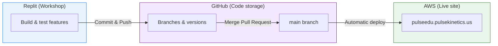
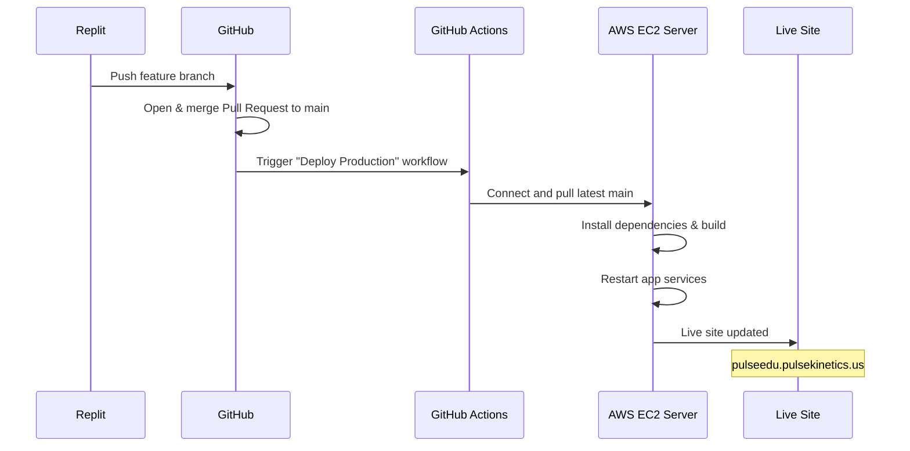

# PulseEDU — Guide: Publishing Work from Replit to the Live Site

**Version:** 1.0  
**Live site:** https://pulseedu.pulsekinetics.us  
**GitHub repository:** https://github.com/arzoof1/PulseEDU4  

---

## What this guide is for

This guide explains how to move a feature built in **Replit** onto the **live PulseEDU site** that schools use every day. The live site runs on **AWS** and updates automatically when code is merged into the **`main`** branch on GitHub.

> **Important:** Pressing **Publish** inside Replit does **not** update the live AWS site. Only changes merged into GitHub **`main`** trigger deployment to production.

---

## Section 1 — Three places to understand

PulseEDU code lives in three separate places. Each has a different job.

| Place | What it is | Who uses it | Address |
|-------|------------|-------------|---------|
| **Replit** | Workshop — build and test new features | You + Replit Agent | Your Replit workspace URL (`*.replit.dev`) |
| **GitHub** | Shared filing cabinet — stores every version of the code | You + the development team | https://github.com/arzoof1/PulseEDU4 |
| **AWS (live)** | Production — what real schools see every day | Automatic (after `main` is updated) | https://pulseedu.pulsekinetics.us |

### Simple analogy

| Step | Real world | PulseEDU |
|------|------------|----------|
| 1 | Write a draft | Build and test in **Replit** |
| 2 | Send the draft to the publisher | **Push** code to **GitHub** |
| 3 | Print the final edition | **Merge** into the **`main`** branch |
| 4 | Books on store shelves | **Live site** on AWS |

### Diagram — how the three places connect



**Text version (if the diagram above does not render after import):**

```
  REPLIT                    GITHUB                      AWS LIVE
  (workshop)                (storage)                   (production)
      |                         |                            |
      |  Commit & Push          |                            |
      +------------------------>|                            |
      |                         |  Merge into "main"         |
      |                         +--------------------------->|
      |                         |         Auto-deploy        |
      |                         |                            v
      |                         |              pulseedu.pulsekinetics.us
```

> **[SCREENSHOT PLACEHOLDER — Figure 1]**  
> **Capture from:** Replit — app running in the preview panel  
> **Show:** Browser URL bar with the Replit address (`*.replit.dev`) and the PulseEDU app loaded  
> **Suggested filename:** `01-replit-workshop.png`  
> **Caption:** Figure 1 — Replit is the workshop. This is not the live site.

---

> **[SCREENSHOT PLACEHOLDER — Figure 2]**  
> **Capture from:** Replit — Deploy / Publish area  
> **Show:** The Publish or Deploy button  
> **Suggested filename:** `02-replit-publish-not-live.png`  
> **Caption:** Figure 2 — Publishing in Replit does **not** update the live AWS site. Add a red label in the image if helpful.

---

> **[SCREENSHOT PLACEHOLDER — Figure 3]**  
> **Capture from:** Browser — live production site  
> **Show:** https://pulseedu.pulsekinetics.us loaded in the address bar  
> **Suggested filename:** `03-live-site.png`  
> **Caption:** Figure 3 — This is the live site that schools use. Updates only arrive here after code is merged to `main` on GitHub.

---

## Section 2 — Golden rules

Read these before every deployment. They prevent the problems that occurred when Replit work and production code had diverged.

### Always do

1. **Test in Replit first** — confirm the feature works in the Replit preview before pushing to GitHub.
2. **Pull before pushing** — sync the latest code from GitHub before committing. This reduces merge conflicts.
3. **Use a feature branch** — never commit large changes directly on `main`. Create a branch such as `replit/my-feature-june-12`.
4. **Wait for the green checkmark** — after merging to `main`, open GitHub Actions and wait until deployment finishes successfully.
5. **Verify on the live URL** — open https://pulseedu.pulsekinetics.us and confirm the feature appears (use a hard refresh: **Cmd+Shift+R** on Mac, **Ctrl+Shift+R** on Windows).

### Never do

1. **Do not use Replit Publish to update AWS** — Publish only affects Replit hosting, not the live school site.
2. **Do not push large changes straight to `main` without pulling first** — this caused severe merge conflicts in the past.
3. **Do not merge database or schema changes without developer review** — live schools hold real student data. Incorrect database changes can lock users out or corrupt data.
4. **Do not assume instant updates** — live deployment usually takes **5–15 minutes** after a merge to `main`.

### When to stop and contact the developer

Contact the developer immediately if any of the following occur:

- GitHub shows **merge conflicts** on a Pull Request
- Replit Agent mentions **database**, **schema**, **migration**, or **tables**
- GitHub Actions shows a **red X** (failed deployment)
- The live site behaves incorrectly after a deployment (login failures, missing data, broken pages)
- Uncertainty about whether a change is safe to merge

> **[SCREENSHOT PLACEHOLDER — Figure 4]**  
> **Capture from:** Replit Agent chat (or a staged example)  
> **Show:** A message that mentions schema, database, or migration — with a visible **STOP** label added in an image editor  
> **Suggested filename:** `04-stop-database-changes.png`  
> **Caption:** Figure 4 — If the agent talks about database changes, stop and contact the developer before merging to `main`.

---

## Section 3 — How automatic deployment works

When code is merged into the **`main`** branch on GitHub, deployment to AWS happens automatically. No manual server login is required.

### Deployment flow



**Text version:**

```
  1. Push branch from Replit to GitHub
  2. Merge Pull Request into "main"
  3. GitHub Actions runs "Deploy Production" (triggered by push to main)
  4. AWS server pulls code, builds, and restarts the app
  5. Live site reflects the changes (allow 5–15 minutes)
```

> **[SCREENSHOT PLACEHOLDER — Figure 5]**  
> **Capture from:** GitHub → repository → **Actions** tab  
> **Show:** "Deploy Production" workflow running (yellow indicator)  
> **Suggested filename:** `05-github-actions-running.png`  
> **Caption:** Figure 5 — Deployment in progress. Wait until this finishes before checking the live site.

---

> **[SCREENSHOT PLACEHOLDER — Figure 6]**  
> **Capture from:** GitHub → **Actions** tab  
> **Show:** "Deploy Production" workflow with a green checkmark (success)  
> **Suggested filename:** `06-github-actions-success.png`  
> **Caption:** Figure 6 — Deployment succeeded. The live site should update shortly.

---

## Section 4 — Step-by-step: from Replit to live

Follow these steps in order every time a feature should go to production.

### Before starting — checklist

- [ ] The feature works in the Replit preview
- [ ] There is a short note about what changed (one sentence is enough)
- [ ] Replit Agent did **not** change the database or schema (if it did, contact the developer first)

---

### Phase A — Open Git in Replit

1. Open the PulseEDU project in Replit.
2. Open the **Version Control** or **Git** panel (usually in the left sidebar or Tools menu).

> **[SCREENSHOT PLACEHOLDER — Figure 7]**  
> **Capture from:** Replit — Git / Version Control panel  
> **Show:** Git panel open with the repository name visible  
> **Suggested filename:** `07-replit-git-panel.png`  
> **Caption:** Figure 7 — Open the Git panel before making any commits.

---

### Phase B — Pull the latest code from GitHub

3. In the branch selector, select **`main`**.
4. Click **Pull** (or **Sync** / **Fetch**) to download the latest code from GitHub.
5. Wait until the pull completes. If conflicts appear, **stop** and contact the developer.

> **[SCREENSHOT PLACEHOLDER — Figure 8]**  
> **Capture from:** Replit Git — branch on `main`, Pull button visible  
> **Show:** Successful pull or "up to date" message  
> **Suggested filename:** `08-pull-latest.png`  
> **Caption:** Figure 8 — Always pull the latest `main` before creating a new branch.

---

### Phase C — Create a feature branch

6. Create a **new branch** from `main`.
7. Use a clear name, for example: `replit/ticketing-export-june-12`
8. Confirm the branch name is **not** `main` before continuing.

> **[SCREENSHOT PLACEHOLDER — Figure 9]**  
> **Capture from:** Replit Git — Create branch dialog  
> **Show:** New branch name typed in (example: `replit/my-feature-june-12`)  
> **Suggested filename:** `09-create-branch.png`  
> **Caption:** Figure 9 — Create a feature branch. Do not commit large changes directly on `main`.

---

### Phase D — Commit the changes

9. Review the list of **changed files** in the Git panel.
10. Write a short **commit message** in plain English, for example: `Add export button to ticketing page`
11. Click **Commit**.

> **[SCREENSHOT PLACEHOLDER — Figure 10]**  
> **Capture from:** Replit Git — changed files list  
> **Show:** List of modified files before committing  
> **Suggested filename:** `10-changed-files-list.png`  
> **Caption:** Figure 10 — Review changed files before committing. Do not commit secret files (`.env`, passwords).

---

> **[SCREENSHOT PLACEHOLDER — Figure 11]**  
> **Capture from:** Replit Git — commit message field and Commit button  
> **Show:** Commit message filled in and Commit button visible  
> **Suggested filename:** `11-commit-message.png`  
> **Caption:** Figure 11 — Write a short commit message, then click Commit.

---

### Phase E — Push to GitHub

12. Click **Push** to send the branch to GitHub.
13. Wait for a success message.

> **[SCREENSHOT PLACEHOLDER — Figure 12]**  
> **Capture from:** Replit Git — Push button or success notification  
> **Show:** Push completed successfully  
> **Suggested filename:** `12-push-to-github.png`  
> **Caption:** Figure 12 — Push sends the branch to GitHub. The live site is not updated yet.

---

14. Open https://github.com/arzoof1/PulseEDU4 in a browser.
15. Confirm the new branch appears under **Branches**.

> **[SCREENSHOT PLACEHOLDER — Figure 13]**  
> **Capture from:** GitHub — Branches page or branch dropdown  
> **Show:** The new branch listed (e.g. `replit/my-feature-june-12`)  
> **Suggested filename:** `13-github-branch-visible.png`  
> **Caption:** Figure 13 — The branch on GitHub confirms the push succeeded.

---

### Phase F — Merge to `main` (go live)

16. On GitHub, click **Pull requests** → **New pull request**.
17. Set **base** to `main` and **compare** to the feature branch.
18. Review the summary. If GitHub reports **merge conflicts**, stop and contact the developer.
19. Click **Create pull request**, then **Merge pull request**, then **Confirm merge**.

> **[SCREENSHOT PLACEHOLDER — Figure 14]**  
> **Capture from:** GitHub — New Pull Request page  
> **Show:** Base: `main` ← Compare: feature branch; "Able to merge" (green) if possible  
> **Suggested filename:** `14-github-pull-request.png`  
> **Caption:** Figure 14 — Open a Pull Request from the feature branch into `main`.

---

> **[SCREENSHOT PLACEHOLDER — Figure 15]**  
> **Capture from:** GitHub — Pull Request merge area  
> **Show:** **Merge pull request** button  
> **Suggested filename:** `15-github-merge-button.png`  
> **Caption:** Figure 15 — Merging to `main` triggers automatic deployment to AWS.

---

20. Go to **Actions** and wait for **Deploy Production** to show a green checkmark (see Figures 5 and 6).

**Alternative:** For large or risky changes, push the branch and send the developer a message instead of merging. Use this template:

```
Branch ready for live: replit/[branch-name]
Change: [one sentence describing the feature]
Ready to merge when convenient.
```

---

### Phase G — Verify on the live site

21. Open https://pulseedu.pulsekinetics.us
22. Hard-refresh the page (**Cmd+Shift+R** / **Ctrl+Shift+R**).
23. Navigate to the feature and confirm it works as expected.
24. If anything looks wrong, note the time and what appears broken, then contact the developer. Do not attempt further merges alone.

> **[SCREENSHOT PLACEHOLDER — Figure 16]**  
> **Capture from:** Browser — live site  
> **Show:** The new feature visible on https://pulseedu.pulsekinetics.us  
> **Suggested filename:** `16-verify-live-site.png`  
> **Caption:** Figure 16 — Confirm the feature on the live URL, not only in Replit.

---

## Section 5 — Why Replit Publish is not the same as going live

A common mistake is building a feature in Replit, pressing **Publish**, and expecting it on https://pulseedu.pulsekinetics.us. That does not happen.

| Action | What updates | What schools see |
|--------|--------------|------------------|
| **Replit Publish** | Replit's own hosting only | No change on the AWS live site |
| **Merge to GitHub `main`** | AWS via automatic deployment | Live site updates |

### What went wrong before (and how to avoid it)

| What happened | What was expected | What actually occurred |
|---------------|-------------------|------------------------|
| Feature built in Replit and Published | Live site would update | Only Replit hosting changed |
| Replit code and `main` had diverged | Easy merge | Many conflicts; two separate development lines |
| Database schema changed in Replit | Same as production database | Live database became inconsistent |

**The fix:** Use the same path every time — **branch → commit → push → merge to `main` → wait for Actions → verify live URL**.

> **[SCREENSHOT PLACEHOLDER — Figure 17]**  
> **Capture from:** Side-by-side composite (image editor)  
> **Show:** Left: feature visible in Replit; Right: same page on live site without the feature  
> **Suggested filename:** `17-replit-vs-live-mismatch.png`  
> **Caption:** Figure 17 — Replit and the live site are separate until code is merged to `main`.

---

## Section 6 — Database changes: extra caution

The live PulseEDU database contains real school data. Database changes are **not** the same as changing a button label or page layout.

**Stop and contact the developer** if Replit Agent:

- Adds or removes database **tables**
- Changes **columns** or field types
- Mentions **schema**, **migration**, or **drizzle**
- Modifies files under `lib/db/src/schema/`

The developer will apply database changes safely on production. Merging schema changes without review can lock out users or damage data.

---

## Section 7 — Quick reference card

Print or bookmark this page.

### To put a feature live

```
1. Test in Replit preview
2. Open Git → Pull latest main
3. Create feature branch (not main)
4. Commit with a short message
5. Push branch to GitHub
6. Open Pull Request → merge into main
7. Wait for green checkmark in GitHub Actions
8. Verify at https://pulseedu.pulsekinetics.us
```

### Do not

- Use Replit **Publish** to update the AWS live site
- Push large changes to `main` without pulling first
- Merge database/schema changes without developer review
- Assume the live site updates instantly (allow 5–15 minutes)

### Key addresses

| Item | URL |
|------|-----|
| Live site | https://pulseedu.pulsekinetics.us |
| GitHub repo | https://github.com/arzoof1/PulseEDU4 |
| GitHub Actions | https://github.com/arzoof1/PulseEDU4/actions |

### Deployment trigger (technical reference)

Only pushes to the **`main`** branch start production deployment. The GitHub workflow is named **Deploy Production**.

---

## Section 8 — Troubleshooting

| Problem | Likely cause | What to do |
|---------|--------------|------------|
| Feature works in Replit but not on live | Code not merged to `main`, or deployment still running | Check GitHub Actions; confirm merge to `main`; hard-refresh live site |
| "Merge conflicts" on Pull Request | Replit and `main` diverged | Stop merging; contact the developer |
| GitHub Actions red X | Build or deploy error on server | Contact the developer with a screenshot of the failed run |
| Live site broken after deploy | Bad merge or database issue | Contact the developer immediately; avoid further merges |
| Replit Agent changed database files | Schema change without prod migration | Do not merge; contact the developer |

> **[SCREENSHOT PLACEHOLDER — Figure 18]** *(optional)*  
> **Capture from:** GitHub — failed Actions run (red X)  
> **Suggested filename:** `18-github-actions-failed.png`  
> **Caption:** Figure 18 — A failed deployment. Contact the developer; do not retry blindly.

---

## Screenshot checklist (for document preparation)

Use this list when inserting images into Google Docs after import.

| Figure | Filename | Capture location |
|--------|----------|------------------|
| 1 | `01-replit-workshop.png` | Replit — app in preview |
| 2 | `02-replit-publish-not-live.png` | Replit — Publish/Deploy button |
| 3 | `03-live-site.png` | Browser — pulseedu.pulsekinetics.us |
| 4 | `04-stop-database-changes.png` | Replit Agent — database/schema mention |
| 5 | `05-github-actions-running.png` | GitHub Actions — in progress |
| 6 | `06-github-actions-success.png` | GitHub Actions — success |
| 7 | `07-replit-git-panel.png` | Replit — Git panel |
| 8 | `08-pull-latest.png` | Replit — Pull on main |
| 9 | `09-create-branch.png` | Replit — new branch |
| 10 | `10-changed-files-list.png` | Replit — changed files |
| 11 | `11-commit-message.png` | Replit — commit |
| 12 | `12-push-to-github.png` | Replit — push success |
| 13 | `13-github-branch-visible.png` | GitHub — branch listed |
| 14 | `14-github-pull-request.png` | GitHub — new PR |
| 15 | `15-github-merge-button.png` | GitHub — merge button |
| 16 | `16-verify-live-site.png` | Live site — feature visible |
| 17 | `17-replit-vs-live-mismatch.png` | Composite — Replit vs live |
| 18 | `18-github-actions-failed.png` | GitHub Actions — failed *(optional)* |

---

*End of guide*
